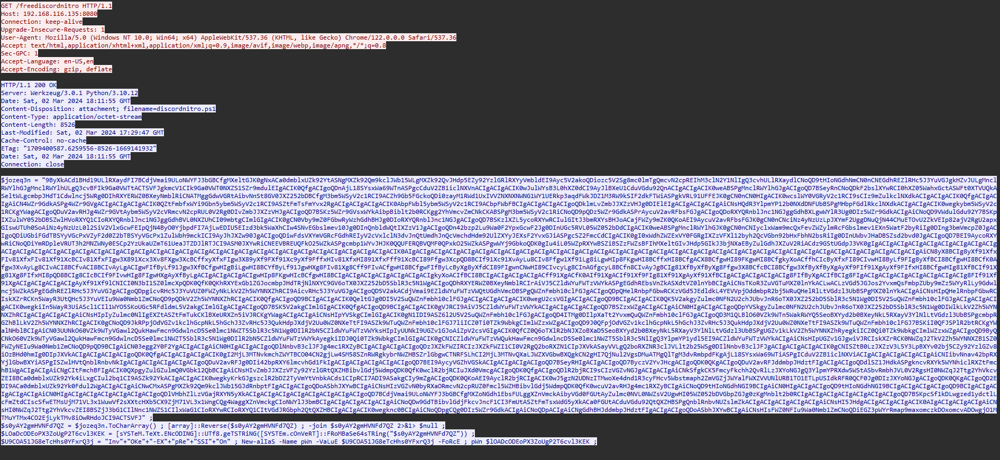
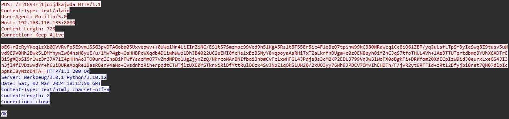

# Forensics: fake-boost
solver: [ProfessorZak](https://github.com/ProfessorZak)  
writeup-writer: [ProfessorZak](https://github.com/ProfessorZak) + [L3d](https://github.com/imL3d)
___
**Author:** gordic  
**Description:**
> In the shadow of The Fray, a new test called "Fake Boost" whispers promises of free Discord Nitro perks. It's a trap, set in a world where nothing comes without a cost. As factions clash and alliances shift, the truth behind Fake Boost could be the key to survival or downfall. Will your faction see through the deception? KORP™ challenges you to discern reality from illusion in this cunning trial.  

**files (from [HTB](https://github.com/hackthebox/cyber-apocalypse-2024)):** [forensics_fake_boost.zip](https://github.com/hackthebox/cyber-apocalypse-2024/raw/main/forensics/%5BEasy%5D%20Fake%20Boost/release/forensics_fake_boost.zip)

In this challenge, we are given a file, "capture.pcapng". We need to analyse this capture file, and extract the flag.

## Solution


### Part 1 😎

Upon examining the pcapng we see that it' essense an HTTP communication, and on closer look we can find specifically one interesting packet, that seems to contain a long base64 encoded string - some sort of a powershell exploit:  

  

Lets understand what it does:  
First, it saves a base64 encoded string into a variable, then reverses the string, then decodes it, and then executes it.  
So let's do the same! (Except [running it](_images/ran.gif) ;))  
We get this powerhsell script output: [output.ps](files/output.ps1).  
  
This code extracts some important data out of the machine, then encrypted it, and finally posts it to the following endpoint: `"http://192.168.116.135:8080/rj1893rj1joijdkajwda"`.  
Another important thing we can see is the first part of the flag:  
`$part1 = "SFRCe2ZyMzNfTjE3cjBHM25fM3hwMDUzZCFf"`  
After decoding: `“HTB{fr33_N17r0G3n_3xp053d!_”`.  


### Part 2 🥂


After filtering by packets that are being sent to the endpoint we saw earlier, we found one packet that seems unique - again, with a base64 endoded string:

  

To decrypt it we need to use [AES](https://en.wikipedia.org/wiki/Advanced_Encryption_Standard) mode CBC, as the powershell exploit we found at the first part encrypt this in that way:  
```ps1
# This function is being called without $mode
# The default encryption mode for the AesManaged object is CBC
function Create-AesManagedObject($key, $IV, $mode) {
    $aesManaged = New-Object "System.Security.Cryptography.AesManaged"
    ...
}
...
$AES_KEY = "Y1dwaHJOVGs5d2dXWjkzdDE5amF5cW5sYUR1SWVGS2k="
```
Using a short python script we decrypt the the message, to find the flag:
```python
from Crypto.Cipher import AES
import base64

cipher = AES.new(base64.b64decode(key.encode()), AES.MODE_CBC)
decrypted = cipher.decrypt(base64.b64decode(encrypted.encode()))


print(decrypted)
```
And the output:  
```
b'\xaf\xb1\x81Df\xb9\xe4\xedu\xb2\xb0\xde\xea\x8f\x19\xbc[\r\n    {\r\n        "ID":  "1212103240066535494",\r\n        "Email":  "YjNXNHIzXzBmX1QwMF9nMDBkXzJfYjNfN3J1M18wZmYzcjV9",\r\n        "GlobalName":  "phreaks_admin",\r\n        "Token":  "MoIxtjEwMz20M5ArNjUzNTQ5NA.Gw3-GW.bGyEkOVlZCsfQ8-6FQnxc9sMa15h7UP3cCOFNk"\r\n    },\r\n    {\r\n        "ID":  "1212103240066535494",\r\n        "Email":  "YjNXNHIzXzBmX1QwMF9nMDBkXzJfYjNfN3J1M18wZmYzcjV9",\r\n        "GlobalName":  "phreaks_admin",\r\n        "Token":  "MoIxtjEwMz20M5ArNjUzNTQ5NA.Gw3-GW.bGyEkOVlZCsfQ8-6FQnxc9sMa15h7UP3cCOFNk"\r\n    }\r\n]\x05\x05\x05\x05\x05'
```
Again, decoding further with base64 the email's content, we find the rest of the flag: `"b3W4r3_0f_T00_g00d_2_b3_7ru3_0ff3r5}"`  
  
Flag🚩:  
`"HTB{fr33_N17r0G3n_3xp053d!_b3W4r3_0f_T00_g00d_2_b3_7ru3_0ff3r5}"`  